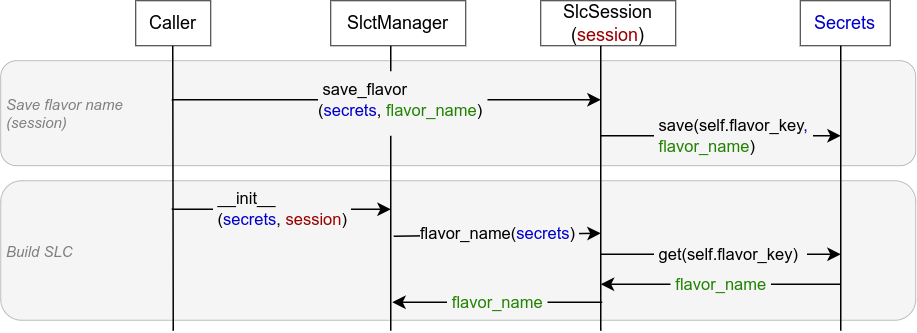

# Notebook Connector User Guide

## SlctManager

Class `SlctManager` in the Notebook Connector (NC) supports building different flavors of [Exasol Script Language Containers](https://github.com/exasol/script-languages-release) (SLCs). SlctManager uses [script-languages-container-tool](https://github.com/exasol/script-languages-container-tool) internally.

* The name of the SLC flavor must be provided in the Secret Configuration Store (SCS) passed as parameter `secrets` to the constructor of SlctManager.
* Additionally the caller must specify the *key* in the SCS for finding the flavor name.

The constructor therefore supports the additional optional parameter `session`:

